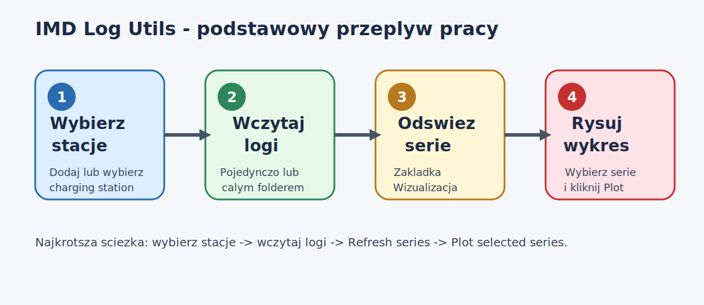
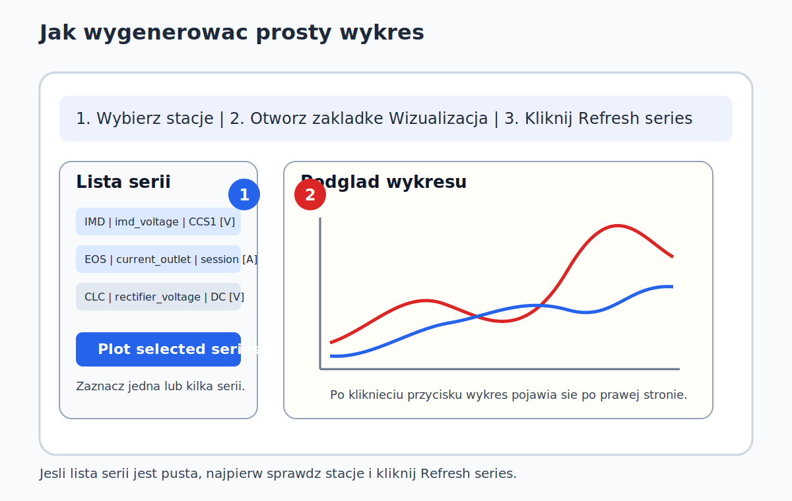
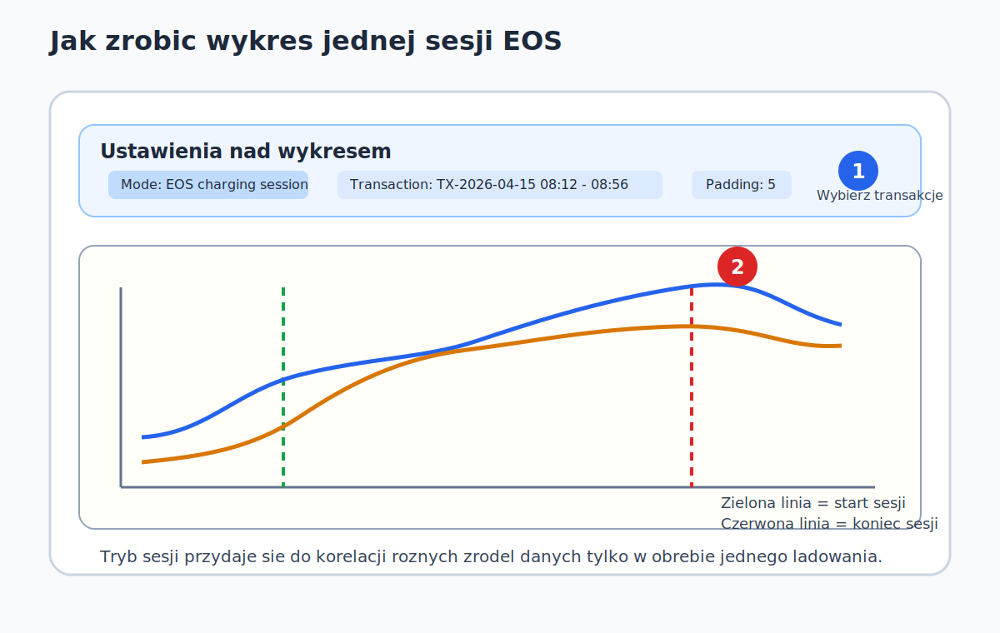
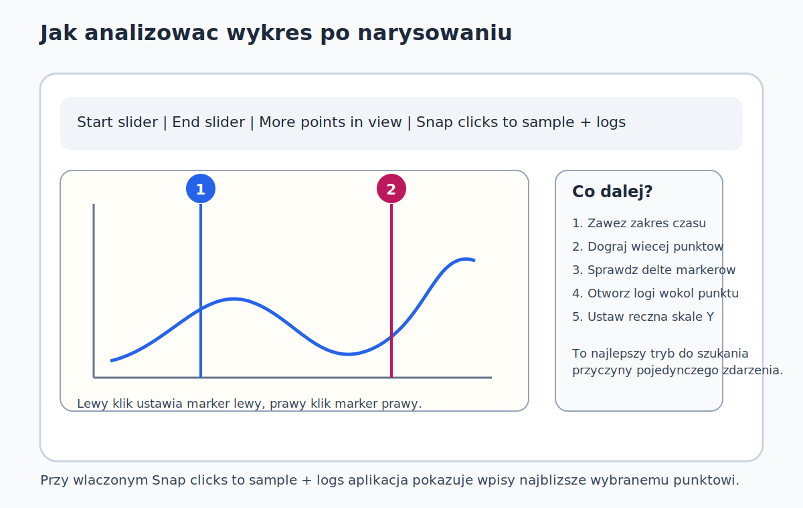

# IMD Log Utils - one pager

Szybka instrukcja z obrazkami do codziennej pracy.

## 1. Najprostsza sciezka pracy

### Krok po kroku

1. Wybierz stacje na gorze okna.
2. Wczytaj logi:
   - pojedynczo przez odpowiednia zakladke,
   - albo hurtowo przez `Wczytaj dane`.
3. Przejdz do `Wizualizacja`.
4. Kliknij `Refresh series`.
5. Zaznacz serie po lewej stronie.
6. Kliknij `Plot selected series`.
7. Uzyj suwakow czasu, gdy chcesz zawezic widok.

## 2. Jak zrobic prosty wykres

### Minimalny scenariusz

1. Wybierz stacje.
2. Zaimportuj logi.
3. Otworz `Wizualizacja`.
4. Ustaw `Mode = Full time horizon`.
5. Kliknij `Refresh series`.
6. Zaznacz jedna lub kilka serii.
7. Kliknij `Plot selected series`.

## 3. Jak zrobic wykres jednej sesji EOS

### Krok po kroku

1. Zaimportuj logi EOS dla wybranej stacji.
2. Otworz `Wizualizacja` albo `Wizualizacja (3 wykresy)`.
3. Ustaw `Mode = EOS charging session`.
4. Wybierz `Transaction`.
5. Ustaw `Padding [min]`, jesli chcesz kontekst przed i po sesji.
6. Zaznacz serie.
7. Kliknij `Plot selected series`.

## 4. Jak wejsc w szczegoly wykresu

### Co robic dalej

1. Zawęz czas suwakami `Start` i `End`.
2. Kliknij `More points in view`, gdy punktow jest za malo.
3. Ustaw znaczniki:
   - lewy klik = marker lewy,
   - prawy klik = marker prawy.
4. Wlacz `Snap clicks to sample + logs`, jezeli chcesz widziec logi wokol punktu.

## 5. Jak usunac jeden niepotrzebny import

1. Otworz zakladke z danym typem logu.
2. W polu `Loaded files` wybierz plik.
3. Kliknij `Delete from DB`.
4. Potwierdz operacje.

## 6. Najwazniejsza zasada

Zawsze najpierw wybierz poprawna stacje, a dopiero potem importuj logi i buduj wykresy.

## 7. Gdzie szukac pelnej instrukcji

Pelna dokumentacja znajduje sie tutaj:

- [Instrukcja uzytkownika](./instrukcja_uzytkownika_pl.md)
